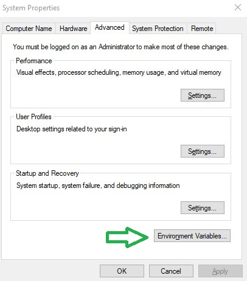
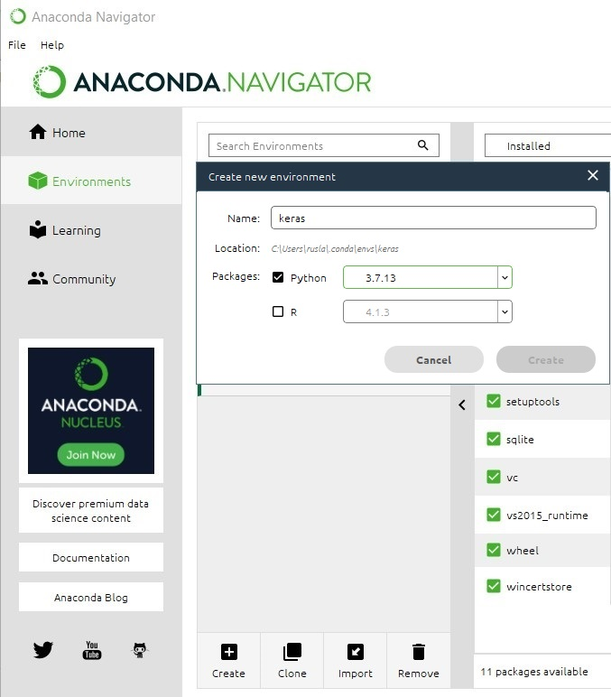

# How to create a Neural Network Python Environment for multiclass classification


In this blog post I will show you how to install your **Enviroment** on your **local machine** and create a Neural Network for multi-class classification of images of one video game **MMORPG-AI**.

### Installation of Conda

First you need to install anaconda at this [link](https://www.anaconda.com/products/individual) 


in this location **C:\Anaconda3** , then you, check that your terminal ,  recognize **conda**

```
C:\conda --version
conda 4.12.0
```

If says 'conda' is not recognized as an internal or external command.

You can try this: for me, I installed anaconda3 into `C:\Anaconda3`. 

Therefore you need to add `C:\Anaconda3` as well as `C:\Anaconda3\Scripts\` to your path variable, e.g. 

```
set PATH=%PATH%;C:\Anaconda3;C:\Anaconda3\Scripts\
```

Or simply fix with adding the **Environment Variable**



and  edit the **Path** with a **New** , and add the `C:\Anaconda3` and `C:\Anaconda3\Scripts\`  and `C:\Anaconda3\Library\bin` , this last one for the download libraries from internet.	


Some times if you got the problem of HTTP 000 Connection, you can copy the files libcrypto-1_1-x64.dll libssl-1_1-x64.dll  from c:\Anaconda3\Library\bin to c:\Anaconda3\DLLs.  


## Environment creation

The  environments supported that I will consider is Python 3.7, Keras 2.9.0 and TensorFlow 2.9

| Framework      | Description                                   |
| :------------- | :-------------------------------------------- |
| TensorFlow 2.9 | TensorFlow 2.9.0 + Keras 2.9.0 on Python 3.7. |

I will create an environment called **keras**,  but you can put the name that you like.

```
conda create -n keras python==3.7
```

If you are running anaconda for first time, you should init conda with the shell that you want to work, in this case I choose the cmd.exe

```
conda init cmd.exe
```

and then close and open the terminal

```
conda activate keras
```

You will have something like this:

```
Microsoft Windows [Version 10.0.19044.1706]
(c) Microsoft Corporation. All rights reserved.
C:\Users\ruslanmv>conda activate keras
(keras) C:\Users\ruslanmv>
```

another way to perform the same is go to your Anaconda Navigator then go  Environments and create new called **keras**




then in your terminal  type the following commands:

```
conda install ipykernel
```

```
python -m ipykernel install --user --name keras --display-name "Python (Keras)"
```

Then we install  **Tensorflow**

```
pip install tensorflow==2.9.0
```

and **Keras**

```
pip install keras==2.9.0
```

If you will work with Data Science projects  I suggest install additional libraries:

```
pip install matplotlib sklearn numpy ipywidgets scipy pandas pillow tensorboard opencv-python
```

or simply you can create the file **requirements.txt** with all the libraries that you need:

```
pip install -r requirements.txt
```

 then open the Jupyter notebook with the command

```
jupyter notebook&
```

then click New and Select your  Kernel called **Python (Keras)**

And now we are ready to start working.


## Description of the Project

What I want to predict are the keys of a gamepad of a gameplay of one videogame. For this project we will try to predict the button RX, with only three possible outcomes. 

**RX Left, RX zero, RX Right**. I  have chosen this example because is not binary classification.  This is a good example to show the difference between **binary classification** and **multi-class classification** and how to modify the **Neural Network** in this situation.


